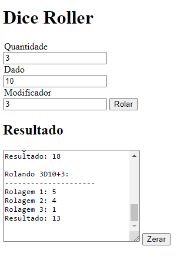

# js-dice-roller
A simple dice roller using javascript and html.

For now it's just a simple HTML page using javascript to implement its logics.
I don't think the logic is fully implemented. Some ideas will come.

Soon i'll use css to make it pretty once i'm happy with my js code. ;)

Here's a glimplse:
